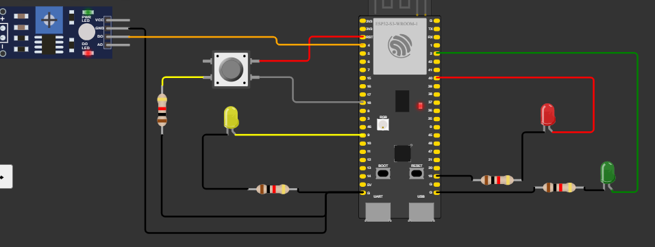

# prova-semana-9

## Estados do sistema

### Incialização
Tudo encontra-se apagado.

### LDR medindo valor baixo (noite)

O LED amarelo entrará em modo piscante, acendendo e apagando a cada segundo

### LDR medindo valor alto (dia)

#### Semáforo

    - Modo convencional:  3 segundos no verde, 2 segundos no amarelo e 5 segundos no vermelho
    - Depois de apertar o botão: Após o botão ser apertado em caso de semáforo fechado, o sistema irá aguardar 1 segundo e colocará o sinal no verde (aberto)
